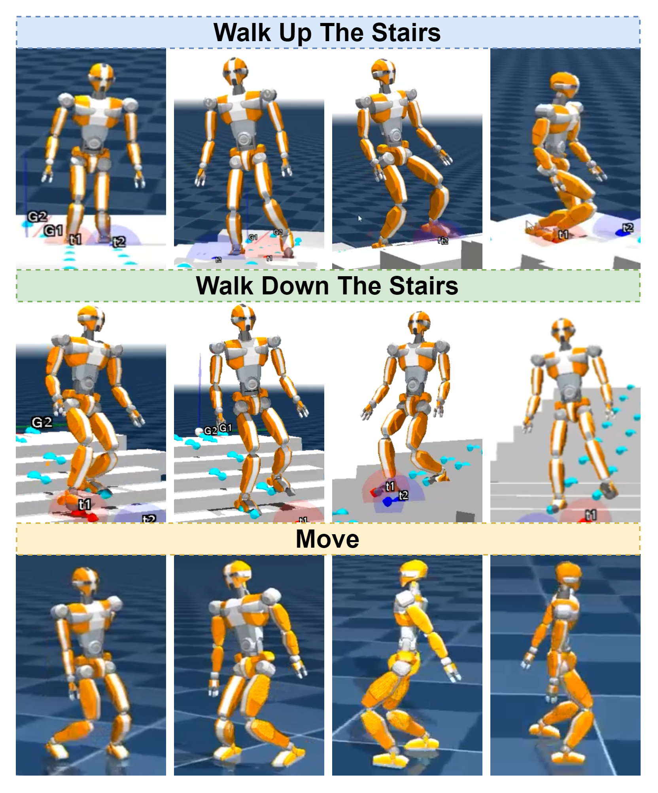

# INTERL: Harmonizing Multimodal Motion Control and Dynamics Modeling for Adaptive Robust Robot Locomotion

<div align="center">



[](https://arxiv.org/abs/XXXX.XXXXX)
[](https://opensource.org/licenses/MIT)
[](https://www.python.org/downloads/)
[](https://pytorch.org/)
[](https://www.docker.com/)

</div>

## 📖 Overview

**INTERL** (**IN**tegrated mo**T**ion control and dynamics mod**E**ling for **R**obust **L**ocomotion) is a novel framework that synergistically combines robotic motion control and dynamics modeling to enable more intelligent and adaptive locomotion through reinforcement learning. 

The control of dynamic locomotion in walking robots presents significant challenges due to the complexity of coordinating high-dimensional joint movements while maintaining balance and stability. Existing approaches often rely on either low-level motion control or high-level trajectory planning, struggling to effectively integrate the two paradigms. INTERL bridges this gap, establishing a unified approach that leverages the complementary benefits of motion control and dynamics modeling.

<div align="center">

</div>

## 🌟 Key Features

INTERL introduces three innovative components:

- **🔍 Pose Analysis Network (PAN)**: Extracts spatiotemporal visual features from robot movements
- **🔄 Kinematic Structure Encoder (KSE)**: Transforms features into a cross-modal embedding space shared with textual descriptions
- **🧠 Motion Correlation Engine (MCE)**: Facilitates vision-language-motion fusion through a novel attention mechanism

## 🏗️ Architecture

<div align="center">

</div>

The architectural overview of INTERL for asynchronous embodied dynamic locomotion learning, featuring three core components:

1. **Pose Analysis Network (PAN)**: Processes visual inputs using a multi-resolution temporal convolutional architecture and spectral graph convolution
2. **Kinematic Structure Encoder (KSE)**: Utilizes skeleton-aware self-attention and cross-attention mechanisms to analyze robot posture and movement
3. **Motion Correlation Engine (MCE)**: Provides semantic feedback, which is integrated into the RL process through innovative state representation and reward function adjustment

## 🚀 Installation

### Prerequisites

- Python 3.7+
- PyTorch 1.10+
- CUDA 11.3+ (for GPU acceleration)

### Option 1: Using Docker (Recommended)

```bash
# Clone the repository
git clone https://github.com/INTERL-Project/INTERL.git
cd INTERL

# Run the docker container
bash docker_run.sh
```

### Option 2: Manual Installation

```bash
# Clone the repository
git clone https://github.com/INTERL-Project/INTERL.git
cd INTERL

# Create a virtual environment
python -m venv venv
source venv/bin/activate  # On Windows: venv\Scripts\activate

# Install dependencies
pip install -r requirements.txt
```

## 📊 Results

INTERL significantly outperforms state-of-the-art baselines across multiple metrics:

<div align="center">

| Model | Average Return | Success Rate (%) | Energy Efficiency | Robustness Score |
|-------|---------------|-----------------|-------------------|------------------|
| DiffMotion | 2376.8 ± 163.4 | 78.9 ± 3.5 | 0.73 ± 0.04 | 0.72 ± 0.04 |
| TransLocoMotion | 2418.5 ± 159.2 | 80.3 ± 3.2 | 0.76 ± 0.03 | 0.75 ± 0.03 |
| VLA-Locomotor | 2527.6 ± 148.3 | 82.6 ± 3.0 | 0.78 ± 0.03 | 0.79 ± 0.03 |
| Fastmimic | 2289.3 ± 172.5 | 76.4 ± 3.6 | 0.71 ± 0.04 | 0.70 ± 0.04 |
| WocaR-RL | 2486.9 ± 155.7 | 81.9 ± 3.1 | 0.77 ± 0.03 | 0.78 ± 0.03 |
| **INTERL (Uneven Terrain)** | **3012.4 ± 145.2** | **89.7 ± 2.5** | **0.82 ± 0.03** | **0.87 ± 0.03** |
| **INTERL (Dynamic Obstacles)** | **2945.9 ± 151.8** | **88.3 ± 2.7** | **0.81 ± 0.04** | **0.85 ± 0.04** |
| **INTERL (Varying Friction)** | **3078.3 ± 139.7** | **90.8 ± 2.3** | **0.84 ± 0.03** | **0.88 ± 0.03** |

</div>

<div align="center">

</div>

## 🛠️ Usage

### Training

```bash
# Train a model with default parameters
python scripts/train.py --env uneven_terrain --model interl

# Train with custom parameters
python scripts/train.py --env varying_friction --model interl --lr 0.0003 --batch_size 128
```

### Evaluation

```bash
# Evaluate a trained model
python scripts/evaluate.py --model_path checkpoints/interl_uneven_terrain.pt --env uneven_terrain

# Visualize results
python scripts/visualize.py --model_path checkpoints/interl_uneven_terrain.pt --env uneven_terrain
```

### Transfer Learning

```bash
# Transfer to quadruped robot
python scripts/transfer.py --source humanoid --target quadruped --model_path checkpoints/interl_full.pt
```

## 📁 Repository Structure

```
INTERL/
├── envs/                  # Environment definitions
├── network/               # Neural network architectures
│   ├── pan.py             # Pose Analysis Network
│   ├── kse.py             # Kinematic Structure Encoder
│   └── mce.py             # Motion Correlation Engine
├── rl/                    # Reinforcement learning algorithms
├── scripts/               # Training and evaluation scripts
├── tasks/                 # Task definitions
├── util/                  # Utility functions
├── docker_run.sh          # Docker script
└── requirements.txt       # Python dependencies
```

## 🔬 Ablation Studies

Our ablation studies demonstrate the synergistic effect of integrating all three core components:

<div align="center">

| Model Variant | Average Return | Success Rate (%) |
|---------------|---------------|-----------------|
| INTERL (PAN only) | 2389.3 ± 168.7 | 78.3 ± 3.9 |
| INTERL (KSE only) | 2274.6 ± 173.2 | 75.8 ± 4.1 |
| INTERL (MCE only) | 2158.9 ± 175.8 | 73.4 ± 4.3 |
| INTERL (PAN+KSE) | 2763.5 ± 157.3 | 85.2 ± 3.2 |
| INTERL (PAN+MCE) | 2681.2 ± 160.8 | 83.9 ± 3.4 |
| INTERL (KSE+MCE) | 2569.7 ± 165.4 | 81.7 ± 3.6 |
| **INTERL (Full)** | **3045.4 ± 142.6** | **90.2 ± 2.4** |

</div>

## 📊 Environmental Performance

<div align="center">

</div>

## 🏆 Citation

If you find our work useful in your research, please consider citing:

```bibtex
@article{wang2024harmonizing,
  title={Harmonizing Multimodal Motion Control and Dynamics Modeling for Adaptive Robust Robot Locomotion in Unstructured Terrains},
  author={Wang, Haoyu and Qiu, Xihe and Xu, Yinghui and Li, Sijia and Tan, Xiaoyu},
  journal={arXiv preprint arXiv:XXXX.XXXXX},
  year={2024}
}
```

## 🤝 Contributing

We welcome contributions to INTERL! Please see our [contributing guidelines](CONTRIBUTING.md) for more information.

## 📄 License

This project is licensed under the MIT License - see the [LICENSE](LICENSE) file for details.

## 📧 Contact

For questions or feedback, please contact:
- Haoyu Wang (corresponding author): wanghy@sues.edu.cn
